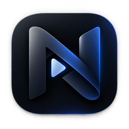

<p align="center">
  
</p>

<h1 align="center">Nook</h1>

<p align="center">
  <strong>A video player that lives in your VS Code panel, right next to the terminal.</strong>
</p>

<p align="center">
  
  <a href="LICENSE"></a>
  
</p>

<details>
<summary><b>🇹🇷&nbsp; Türkçe</b> &nbsp;</summary>
<br>

Nook'u, tek ekranda kod yazarken picture-in-picture pencereleriyle uğraşmaktan yorulduğum için geliştirdim. Videonun, her seferinde yeniden yerleştirilmesi gereken ve kodun üstünde bir yerlerde duran gezgin bir pencerede değil; editörün içinde, kendine ait sabit bir yerde olmasını istedim. Terminalin yanındaki o boşluk, yani alt panel, tam da bunun için uygundu.

<!-- ekran görüntüsü buraya -->

## Neler yapar

- Alt panelde, terminalin hemen yanında video oynatır.
- Arama kutusuna yazdıklarınızı arar; bir bağlantı yapıştırdığınızda ise videoyu doğrudan açar.
- Kanal adına tıkladığınızda o kanalın videolarını listeler.
- Görüntü kalitesini seçmenize olanak tanır.
- Son 50 videoyu hatırlar ve yarım bıraktığınız yerden devam eder.
- Panel kapalıyken dahi sesi çalmayı sürdürür.
- Oynatılan videonun adını durum çubuğunda gösterir; üzerine tıkladığınızda oynatmayı durdurur.

## Kullanım

Panelden **Nook** sekmesini açın.

**İzlemek için** arama kutusuna aramak istediğinizi yazıp Enter tuşuna basın. Elinizde bir bağlantı varsa doğrudan yapıştırmanız yeterlidir; standart video adreslerinin yanı sıra `youtu.be`, Shorts ve `embed` biçimlerinin tamamı tanınır.

**Kanal gezinmek için** sonuçlarda yer alan kanal adına tıklayın. Kanalın videoları, popüler içerikleri ve oynatma listeleri ayrı sekmeler hâlinde açılır. Geri düğmesi sizi arama sonuçlarına döndürür.

**Kaliteyi değiştirmek için** kontrol çubuğundaki ayar düğmesini kullanın. Seçtiğiniz kalite sonraki videolarda da korunur.

**Geçmişe ulaşmak için** arama kutusunun yanındaki saat simgesine tıklayın. Yarım kalan videolar nerede bırakıldıklarını gösterir ve tıklandığında oradan devam eder. **Clear** düğmesi listeyi temizler.

**Yerden kazanmak için** arama listesini gizleyebilir, aradaki ayırıcıyı sürükleyerek genişliği ayarlayabilir veya paneli tam ekrana genişletebilirsiniz. Videonun ayrıca kendi tam ekran düğmesi bulunur.

Oynatmayı, komut paletindeki **Nook: Play / Pause** komutuyla da duraklatabilirsiniz; video ekranda görünmüyorken en pratik yöntem budur.

## Kurulum

Eklenti Marketplace'te yayımlanmadığından kendi bilgisayarınızda derlemeniz gerekir:

```bash
git clone https://github.com/hootbu/nook-vscode-video-player.git
cd nook-vscode-video-player
npm install
npm run compile
```

Ardından klasörü VS Code'un eklenti dizinine bağlayın ve editörü tümüyle kapatıp yeniden açın:

```bash
ln -s "$PWD" ~/.vscode/extensions/hootbu.nook
```

Yalnızca denemek isterseniz projeyi VS Code'da açıp <kbd>F5</kbd> tuşuna basmanız yeterlidir; açılan pencerenin panelinde Nook sekmesi sizi bekliyor olacaktır.

macOS, Windows ve Linux üzerinde çalışır; VS Code 1.90 veya üzeri sürüm gerektirir.

## Bilinmesi gerekenler

**Hiçbir şey indirmez.** Diske tek bir dosya dahi yazmaz. Yalnızca izlemekte olduğunuz bölüm, yaklaşık on beş saniyelik bir payla bellekte tutulur; duraklattığınızda ise saniyeler içinde veri çekmeyi bırakır. Kalıcı olarak sakladığı tek şey son 50 videonun adı ve kaldığınız konumdur; VS Code'un kendi ayar deposunda duran birkaç kilobaytlık bu metin **Clear** ile silinir.

**Canlı yayınlar açılmaz.** Canlı içerik bütünüyle farklı bir biçimde yayımlandığından bu oynatıcı tarafından desteklenmez.

**Oturum açılamaz.** Dolayısıyla üyelere özel videolar, satın alınmış içerikler ve yaş sınırlı videoların çoğu erişilebilir değildir.

**Üst sınır 1080p'dir.** Editörün güvenilir biçimde çözebildiği tek video biçimiyle sınırlı olduğundan 4K desteklenmez.

**Zaman zaman çalışmayabilir.** YouTube tarafındaki bir değişiklik videoların açılmasını engelleyebilir. Böyle bir durumda ilk denenmesi gereken:

```bash
npm update youtubei.js && npm run compile
```

<br>

<details>
<summary><b>Sorumluluk reddi</b></summary>
<br>

Nook, hobi amacıyla geliştirdiğim deneysel bir projedir. Satılmaz, gelir getirmez ve Marketplace dâhil hiçbir mağazada yayımlanmayacaktır. YouTube ile herhangi bir bağlantısı ya da YouTube tarafından verilmiş bir onayı bulunmamaktadır.

Uygulama içerik barındırmaz, dağıtmaz ve indirmez; videolar YouTube'un kendi sunucularından akar ve telif hakları hak sahiplerine aittir. Videoyu YouTube'un kendi oynatıcısı dışında oynattığı için YouTube'un kullanım şartlarıyla bağdaşmaz. Kurma ve kullanma kararı, doğabilecek sonuçlarla birlikte tümüyle kullanıcıya aittir; geliştirici olarak herhangi bir sorumluluk kabul etmiyorum. Yazılım, [MIT Lisansı](LICENSE) kapsamında "olduğu gibi" sunulmaktadır.

Hak sahiplerinden gelecek bir itiraz hâlinde bu depoyu kaldırırım.

</details>

## Lisans

MIT © Emir Yorgun

<hr>
</details>

I built Nook because I grew tired of wrestling with picture-in-picture windows while coding on a single screen. I wanted the video to have a fixed place of its own inside the editor, rather than a floating window that has to be repositioned every time and sits somewhere on top of my code. The empty space beside the terminal, the bottom panel, turned out to be exactly right.

<!-- screenshot here -->

## What it does

- Plays video in the bottom panel, right next to your terminal.
- Searches whatever you type, and opens a link the moment you paste one.
- Lists a channel's videos when you click its name.
- Lets you choose the picture quality.
- Remembers your last 50 videos and resumes where you left off.
- Keeps playing even while the panel is collapsed.
- Shows the current video's title in the status bar; clicking it stops playback.

## Using it

Open the **Nook** tab in the panel.

**To watch something,** type your search in the box and press Enter. If you already have a link, simply paste it; alongside standard video addresses, `youtu.be`, Shorts and `embed` formats are all recognised.

**To browse a channel,** click its name in the results. The channel's videos, popular uploads and playlists open as separate tabs. The back button returns you to your search results.

**To change quality,** use the settings button in the control bar. Your choice carries over to the next video.

**To reach your history,** click the clock icon beside the search box. Half-watched videos show where they were left off and resume from there when clicked. The **Clear** button empties the list.

**To save space,** hide the search list, drag the divider to adjust its width, or expand the panel to full screen. The video also has a fullscreen button of its own.

You can pause playback from the command palette as well, with **Nook: Play / Pause**, the most practical option when the video isn't on screen.

## Install

The extension isn't published on the Marketplace, so you build it on your own machine:

```bash
git clone https://github.com/hootbu/nook-vscode-video-player.git
cd nook-vscode-video-player
npm install
npm run compile
```

Then link the folder into VS Code's extensions directory and restart the editor completely:

```bash
ln -s "$PWD" ~/.vscode/extensions/hootbu.nook
```

If you only want to try it out, open the project in VS Code and press <kbd>F5</kbd>; the Nook tab will be waiting in the panel of the window that opens.

Works on macOS, Windows and Linux, and requires VS Code 1.90 or newer.

## Good to know

**It downloads nothing.** Not a single file touches your disk. Only the part you're watching is held in memory, with roughly fifteen seconds of headroom, and it stops pulling data within seconds of you pausing. The only thing kept permanently is the title and position of your last 50 videos: a few kilobytes of text in VS Code's own settings storage, cleared with **Clear**.

**Live streams won't open.** Live content is broadcast in an entirely different format, which this player doesn't support.

**There's no sign-in.** Members-only videos, purchased content and most age-restricted videos are therefore out of reach.

**1080p is the ceiling.** The player is limited to the one video format the editor decodes reliably, so 4K isn't supported.

**It may stop working from time to time.** A change on YouTube's side can prevent videos from opening. The first thing to try:

```bash
npm update youtubei.js && npm run compile
```

<br>

<details>
<summary><b>Disclaimer</b></summary>
<br>

Nook is an experimental project I built as a hobby. It is not sold, it earns nothing, and it will not be published on the Marketplace or any other store. It has no connection to YouTube and carries no endorsement from them.

The extension hosts, distributes and downloads no content; video is streamed from YouTube's own servers, and the copyright in it belongs to the rights holders. Because it plays video outside YouTube's own player, it does not sit well with YouTube's terms of service. The decision to install and use it, along with any consequences that follow, rests entirely with the user; as the developer, I accept no liability. The software is provided "as is" under the [MIT License](LICENSE).

Should a rights holder object, I will take this repository down.

</details>

## License

MIT © Emir Yorgun
